# Automa Web 架构流程图

本文档包含 Automa Web 重构的所有架构流程图。

## 1. 整体架构分层图

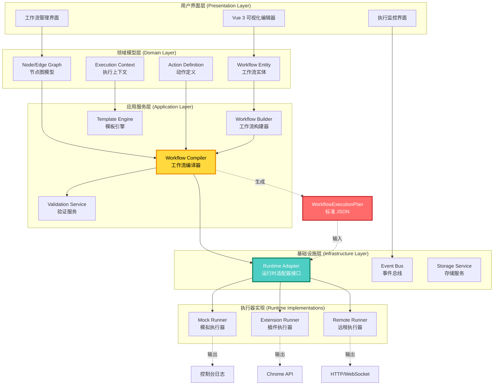

---

## 2. 工作流编译流程

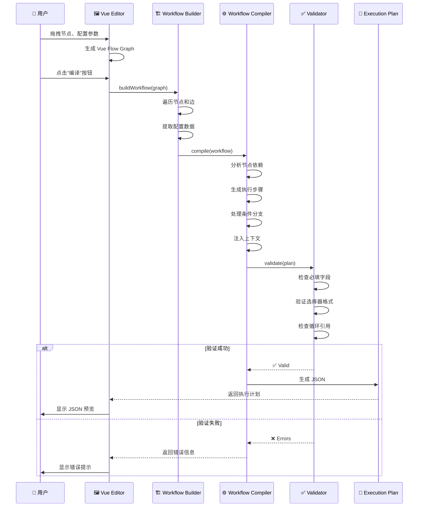

---

## 3. 执行流程对比：旧 vs 新

### 3.1 旧架构（插件模式）

```mermaid
graph LR
    A[用户点击"运行"] --> B[UI 直接调用执行函数]
    B --> C[WorkflowEngine 初始化]
    C --> D[遍历节点]
    D --> E[调用 handlerClick.js]
    E --> F[直接操作 document.querySelector]
    F --> G[直接调用 chrome.tabs API]
    G --> H[返回结果到 UI]

    style E fill:#ff6b6b,stroke:#c92a2a,color:#fff
    style F fill:#ff6b6b,stroke:#c92a2a,color:#fff
    style G fill:#ff6b6b,stroke:#c92a2a,color:#fff

    note1[问题：强耦合<br/>无法在 Web 环境运行]
    style note1 fill:#ffe066,stroke:#f08c00
```

### 3.2 新架构（Web 模式）

```mermaid
graph TB
    A[用户点击"运行"] --> B[UI 触发编译]
    B --> C[生成 WorkflowExecutionPlan JSON]
    C --> D{选择执行器}

    D -->|开发模式| E1[Mock Runner]
    D -->|插件模式| E2[Extension Runner]
    D -->|生产模式| E3[Remote Runner]

    E1 --> F1[控制台输出彩色日志]
    E2 --> F2[调用 Chrome API]
    E3 --> F3[HTTP POST 到后端]

    F1 --> G[返回 ExecutionResult]
    F2 --> G
    F3 --> G

    G --> H[UI 显示执行结果]

    style C fill:#4ecdc4,stroke:#087f5b,color:#fff,stroke-width:3px
    style D fill:#ffd93d,stroke:#f08c00,color:#000,stroke-width:3px
    style G fill:#51cf66,stroke:#2b8a3e,color:#fff,stroke-width:3px

    note1[优势：完全解耦<br/>环境无关<br/>易于测试]
    style note1 fill:#c0eb75,stroke:#5c940d
```

---

## 4. Mock Runner 执行流程

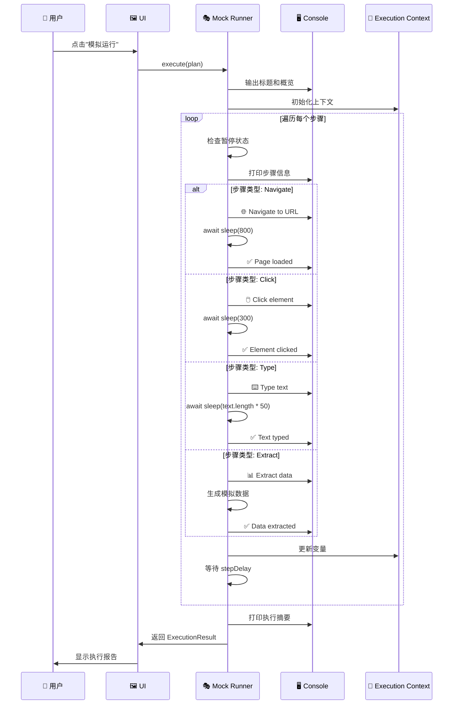

---

## 5. 动作抽象化流程（以 Click 为例）

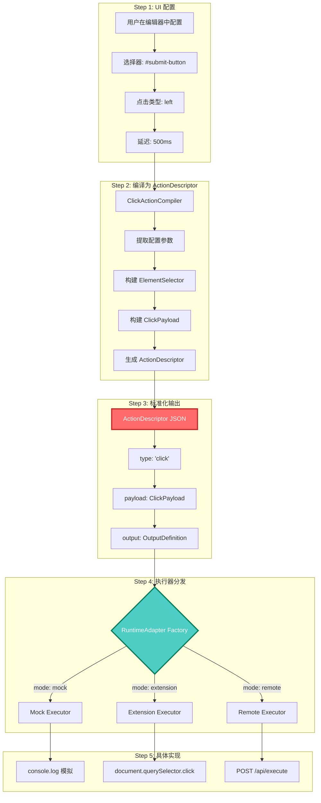

---

## 6. 多环境执行器对比

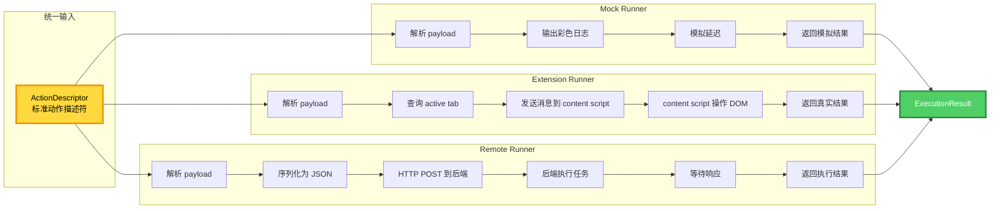

---

## 7. 条件分支和循环处理

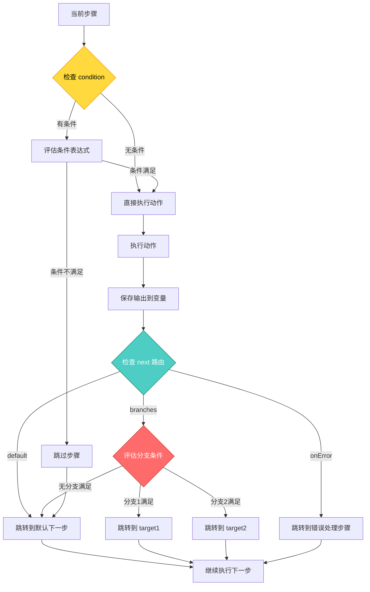

---

## 8. 变量和模板系统

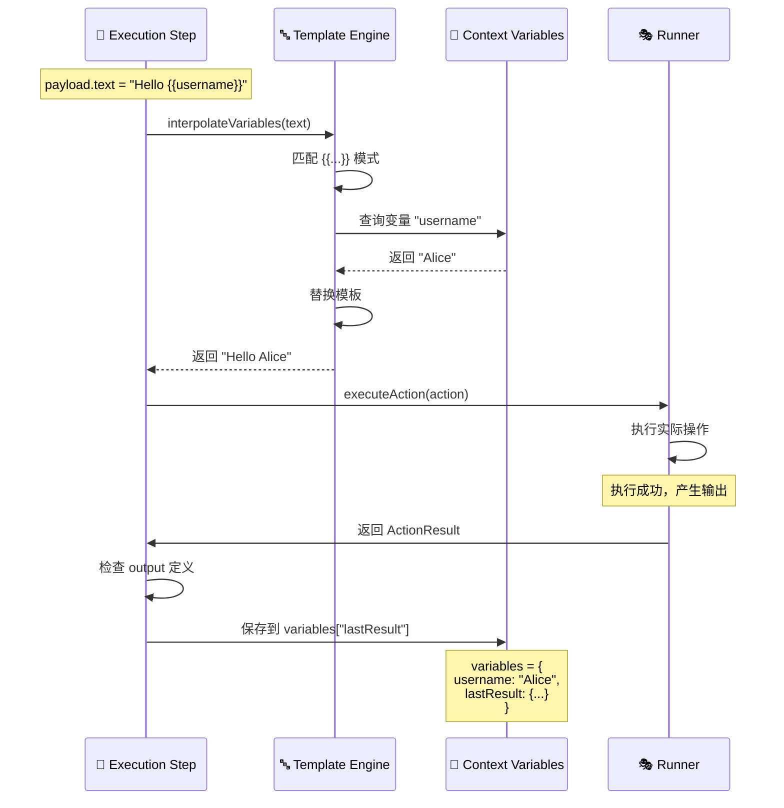

---

## 9. 错误处理和重试策略

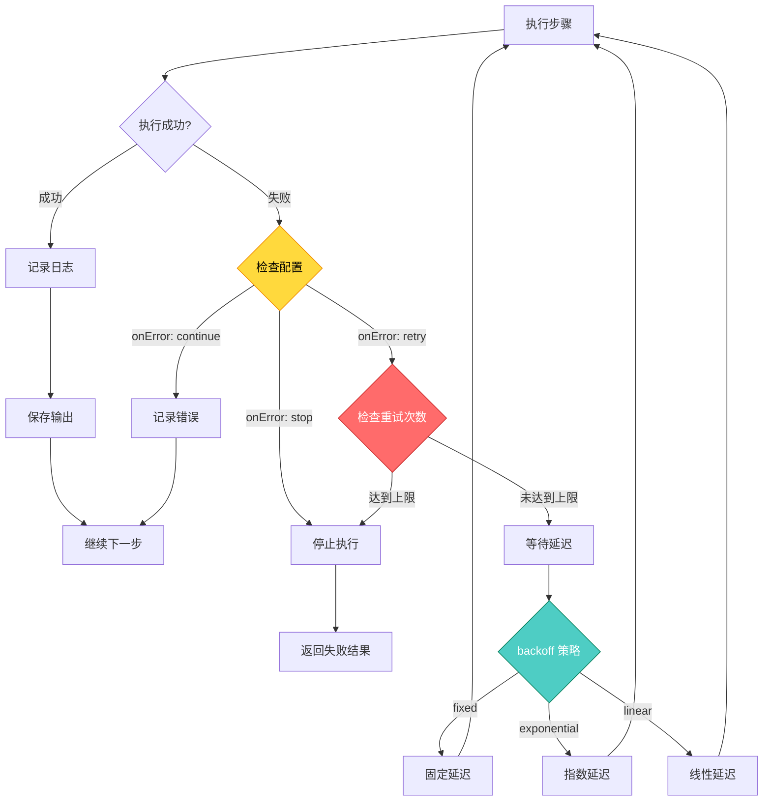

---

## 10. 完整的用户使用流程

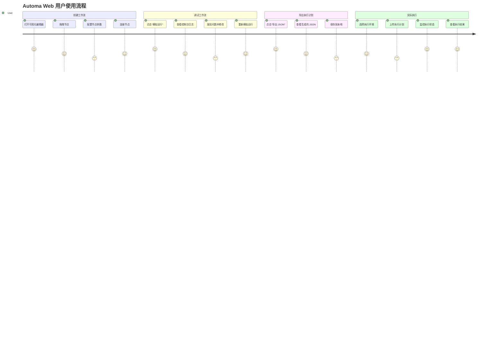

---

## 11. 数据流转全景图

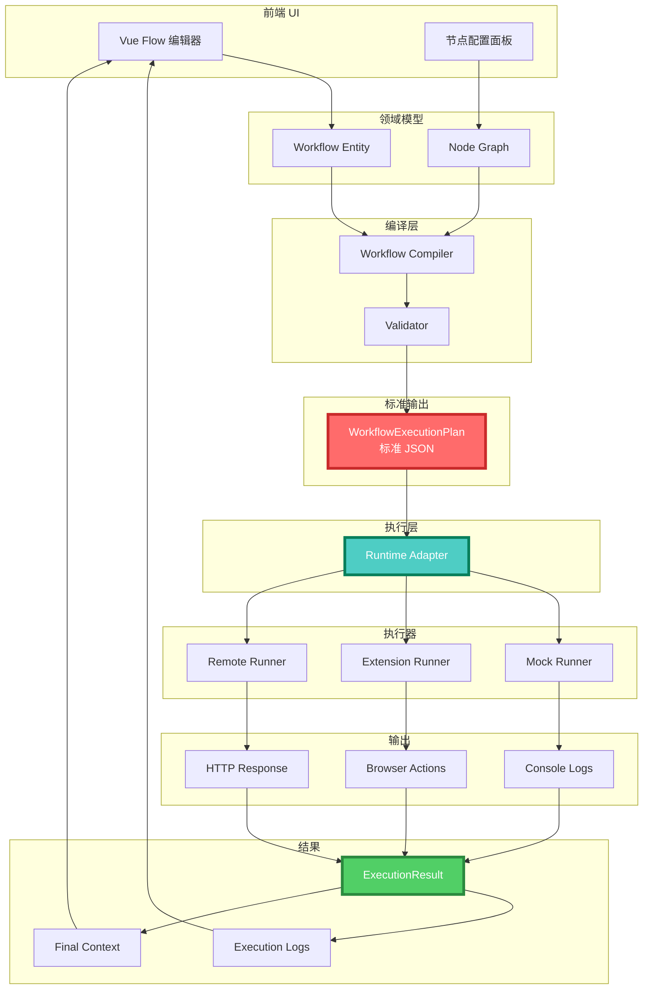

---

## 12. 技术栈和依赖关系

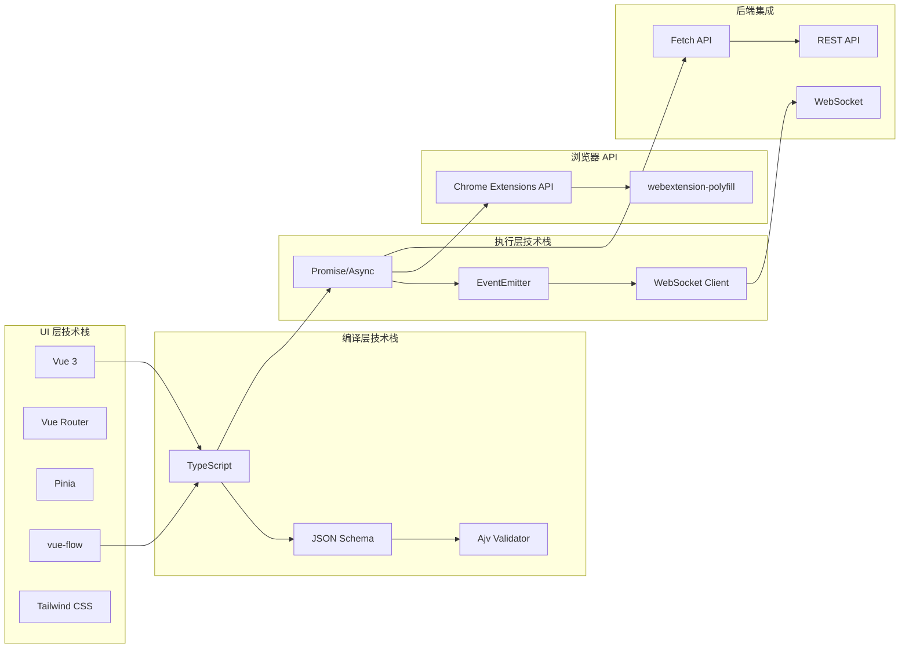

---

## 使用说明

这些流程图展示了 Automa Web 重构的完整架构设计。

### 如何查看

1. **在 GitHub 上查看**：GitHub 原生支持 Mermaid 渲染
2. **在 VSCode 中查看**：安装 Mermaid Preview 插件
3. **在线查看**：复制到 https://mermaid.live/

### 图表索引

- **图 1**: 整体架构分层图 - 理解系统的宏观结构
- **图 2**: 工作流编译流程 - 理解如何从 UI 生成 JSON
- **图 3**: 执行流程对比 - 理解新旧架构的差异
- **图 4**: Mock Runner 执行流程 - 理解模拟执行的细节
- **图 5**: 动作抽象化流程 - 理解如何抽象具体动作
- **图 6**: 多环境执行器对比 - 理解不同执行器的实现
- **图 7**: 条件分支和循环 - 理解控制流的处理
- **图 8**: 变量和模板系统 - 理解动态数据的处理
- **图 9**: 错误处理和重试 - 理解容错机制
- **图 10**: 用户使用流程 - 理解用户体验设计
- **图 11**: 数据流转全景 - 理解完整的数据流动
- **图 12**: 技术栈依赖 - 理解技术选型

### 建议阅读顺序

1. 首先阅读 **图 1** 和 **图 11**，理解整体架构
2. 然后阅读 **图 2** 和 **图 3**，理解核心流程
3. 接着阅读 **图 4** 到 **图 6**，理解执行细节
4. 最后阅读其他图表，理解高级特性

---

**这些流程图是架构设计的可视化表达，建议结合 README.md 和代码一起阅读。**
